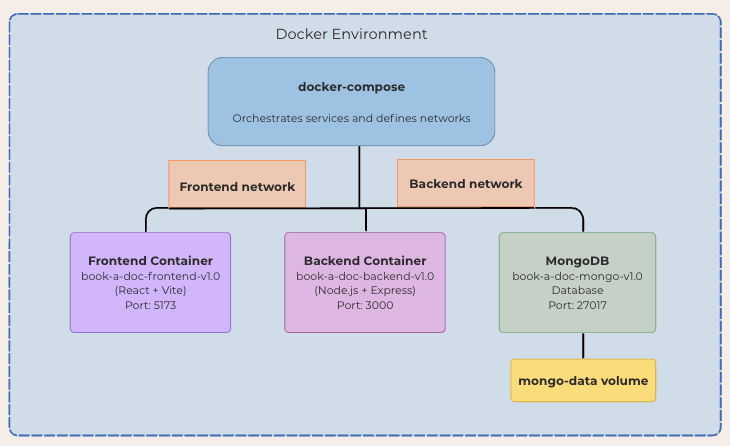
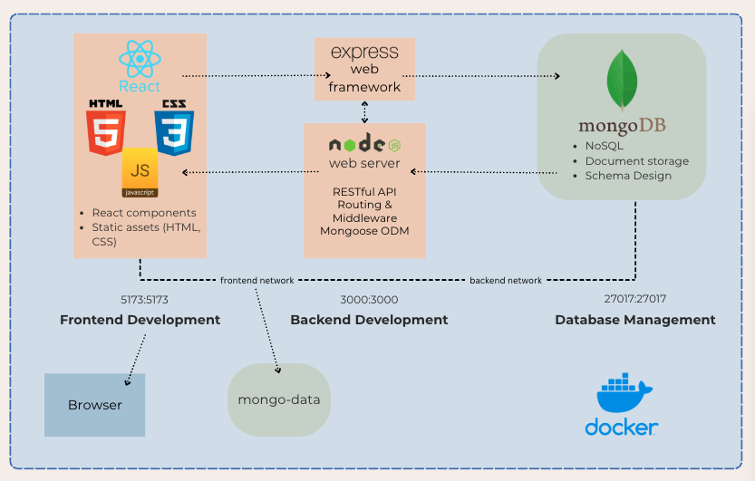

# Book-A-Doc – Containerised MERN Application with CI/CD Pipeline

## Table of Contents

1. [Overview](#overview)  
2. [Application Architecture Diagram](#application-architecture-diagram)  
    - [System Context Diagram](#system-context-diagram)
    - [Container Relationship Diagram](#container-relationship-diagram)
    - [CI/CD Pipeline Diagram](#cicd-pipeline-diagram)
    - [Deployment Architecture Diagram](#deployment-architecture-diagram)
    - [Security Architecture Diagram](#security-architecture-diagram)
    - [Detailed Application Architecture Diagram](#detailed-application-architecture-diagram) 
3. [Technology Stack](#technology-stack)  
4. [CI/CD Pipeline Implementation](#cicd-pipeline-implementation)
    - [Workflow Overview](#workflow-overview)
    - [Testing Automation](#testing-automation)
    - [Deployment Automation](#deployment-automation)
    - [Resource Management](#resource-management)
5. [Containerisation Setup](#containerisation-setup)  
    - [Docker Image Naming and Versioning](#docker-image-naming-and-versioning)  
    - [Environment Configuration](#environment-configuration)  
    - [Project Structure](#project-structure)  
    - [Build Optimisation](#build-optimisation)  
6. [Running the Application](#running-the-application)  
    - [Environment Setup](#environment-setup)  
    - [Development Environment](#development-environment)  
    - [Production Environment](#production-environment)  
7. [Licensing](#licensing)  
8. [Deployment](#deployment)  
    - [CI/CD Integration](#cicd-integration)  
    - [Production Considerations](#production-considerations)   

---

## Overview

Book-A-Doc is a fullstack MERN (MongoDB, Express, React, Node.js) web application designed for booking medical appointments. This project demonstrates modern DevOps practices including comprehensive CI/CD pipeline implementation, containerisation for development environments using Docker and Docker Compose, and automated deployment to AWS cloud infrastructure. All services, including the database, backend, and frontend, are independently containerised for modular development and deployment with complete automation from code commit to production deployment.

---

## Application Architecture Diagram

The Book-A-Doc architecture is represented through multiple diagrams that provide different perspectives on the system:

### 1. System Context Diagram


This high level diagram shows the Book-A-Doc system in relation to its users (patients and doctors) and external systems (cloud deployment and CI/CD pipeline).

### 2. Container Relationship Diagram


This diagram focuses on the Docker containers and how they relate to each other within the Docker environment, highlighting the orchestration through docker-compose, network segmentation, and volume persistence.

### 3. CI/CD Pipeline Diagram


This diagram illustrates the complete automated pipeline from code commit through testing, building, and deployment. It shows the three main workflows: testing automation, build and deployment, and resource cleanup for cost management.

### 4. Deployment Architecture Diagram


This diagram illustrates how the containerised application is deployed in production, including CI/CD pipeline, container registry, secrets management, and the production environment with specialised containers.

### 5. Security Architecture Diagram


This diagram focuses on the security aspects of the application across different layers: external security (SSL/TLS, Nginx headers, CORS), application security (JWT, Helmet, bcrypt), and data security (environment variables, network isolation, volume security).

### 6. Detailed Application Architecture Diagram


The fully containerised Book-A-Doc architecture is split into three main services:

- **Frontend (React + Vite)**
  - Port: `5173`
  - Provides the user interface for patients and doctors
  - Communicates with the backend API via HTTP requests
  - Resides on the `frontend-network`

- **Backend (Node.js + Express)**
  - Port: `3000`
  - Manages authentication, business logic, and API endpoints
  - Uses environment variables for secrets and configuration
  - Middleware includes Helmet (security), CORS, and a global error handler
  - Connected to both `frontend-network` and `backend-network`

- **MongoDB Database**
  - Port: `27017`
  - Stores application data (users, doctors, bookings)
  - Uses volume `mongo-data` for persistent storage  
  - Connected to `backend-network`

- **Docker Compose**
  - Coordinates the startup and dependency order of services via `depends_on`
  - Configures isolated bridge networks and volume bindings for data and communication integrity  

---

## Technology Stack

### Backend
- Node.js  
- Express.js  
- MongoDB  
- Mongoose  
- Helmet, CORS  
- dotenv, JWT, bcrypt  

### Frontend
- React (via Vite)  
- React Router  
- React-DatePicker, React-Loading-Skeleton  

### Development & Testing
- Docker & Docker Compose  
- ESLint (Airbnb Style Guide)  
- Jest (Backend Unit & Integration Testing)
- Vitest (Frontend Unit Testing)
- React Testing Library (Component Testing)
- Cypress (End-to-End Testing)
- Supertest (API Testing)

### CI/CD & DevOps
- GitHub Actions (CI/CD Pipeline)
- AWS ECS (Container Orchestration)
- AWS ECR (Container Registry)
- AWS Parameter Store (Secrets Management)
- AWS CloudWatch (Logging & Monitoring)

### Production
- PM2 Process Manager  
- Nginx Web Server  
- SSL/TLS for secure communication  

---

## CI/CD Pipeline Implementation

### Workflow Overview

The CI/CD pipeline consists of four main GitHub Actions workflows that provide comprehensive automation:

#### 1. Testing Workflow (`test.yml`)
**Triggers:** Push to main/develop branches, Pull requests to main, Manual dispatch
**Purpose:** Comprehensive testing across all application layers

```yaml
# Parallel testing jobs for optimal performance
frontend-tests:
  - Vitest unit tests and component testing
  - ESLint code quality validation
  - Coverage reporting with artifact storage

backend-tests:
  - Jest unit tests with MongoDB Memory Server
  - Integration testing with Supertest
  - Security testing and vulnerability assessment

e2e-tests:
  - Cypress end-to-end testing with full application stack
  - Real browser testing with video recording
  - Complete user workflow validation

test-summary:
  - Consolidated test reporting across all test suites
  - Status aggregation and deployment readiness assessment
```

#### 2. Build and Test Workflow (`build.yml`)
**Triggers:** Push to main/develop branches, Pull requests to main
**Purpose:** Advanced build pipeline with container management

```yaml
# Multi-stage pipeline with advanced optimisations
install:
  - Dependency caching for performance optimisation
  - Parallel frontend/backend dependency installation
  
test:
  - Comprehensive testing with timeout management
  - Coverage reporting with artifact storage
  
security:
  - npm audit security scanning
  - Vulnerability assessment for production dependencies
  
build:
  - Conditional execution (main branch only)
  - AWS ECR integration and authentication
  - Docker image building with production optimisations
```

#### 3. Deployment Workflow (`deploy.yml`)
**Triggers:** Successful completion of build workflow, Manual dispatch
**Purpose:** Automated infrastructure provisioning and application deployment

```yaml
# Infrastructure as Code deployment
- AWS ECS Cluster Creation
- Security Groups & IAM Roles
- Container Image Publishing
- Blue-Green Deployment Strategy
- Health Monitoring & Validation
```

#### 4. Resource Cleanup Workflow (`cleanup.yml`)
**Triggers:** Manual dispatch only
**Purpose:** Complete AWS resource cleanup for cost management

```yaml
# Comprehensive resource cleanup
- ECS Services & Clusters
- ECR Repositories & Images
- CloudWatch Log Groups
- SSM Parameters & Secrets
- Security Groups & IAM Roles
```

### Testing Automation

Our testing strategy implements multiple validation layers to ensure application reliability:

- **Unit Testing:** Individual component and function testing using Jest (backend) and Vitest (frontend)
- **Integration Testing:** API endpoint testing with realistic data scenarios using Supertest and MongoDB Memory Server
- **Security Testing:** Comprehensive security validation including XSS prevention, injection attacks, and authentication testing
- **End-to-End Testing:** Complete user workflow validation using Cypress
- **Coverage Reporting:** Automated test coverage collection with artifact storage for CI/CD pipeline analysis

### Deployment Automation

The deployment process implements a sophisticated blue-green deployment strategy ensuring zero downtime:

1. **Infrastructure Provisioning:** Automated creation of AWS ECS clusters, security groups, and IAM roles
2. **Container Management:** Building and pushing optimised Docker images to Amazon ECR with vulnerability scanning
3. **Secrets Management:** Secure handling of sensitive configuration through AWS Parameter Store
4. **Service Deployment:** Blue-green deployment with automated health checks and rollback capabilities
5. **Monitoring Integration:** CloudWatch logging and performance metrics for ongoing observability

### Resource Management

The cleanup workflow demonstrates production-grade cost management:

- **Complete Resource Inventory:** Systematic cleanup of all AWS resources to prevent unexpected charges
- **Safe Deletion:** Proper dependency handling to avoid resource conflicts
- **Error Handling:** Graceful handling of missing or already-deleted resources
- **Audit Trail:** Comprehensive logging of all cleanup operations

---

## Containerisation Setup

### Docker Image Naming and Versioning

Each container image follows a consistent naming and tagging convention that reflects the application, environment, and version:  

#### Development Environment
- **Frontend**: `book-a-doc-frontend-v1.0-dev`
- **Backend**: `book-a-doc-backend-v1.0-dev`
- **MongoDB**: `book-a-doc-mongo-v1.0-dev`

#### Production Environment
- **Frontend**: `book-a-doc-frontend-v1.0-prod`
- **Backend**: `book-a-doc-backend-v1.0-prod`
- **MongoDB**: `book-a-doc-mongo-v1.0-prod`

These names improve traceability across environments and support the automated CI/CD pipeline image management.

### Environment Configuration

- Backend `.env` file stores:
  - `PORT`
  - `MONGODB_URI`
  - `JWT_SECRET`
  - `ALLOWED_ORIGINS`
- These variables are injected at build/runtime using Docker Compose and excluded from the container via `.dockerignore`.

#### Development vs Production
- Development uses `.env` files for local configuration
- Production uses AWS Parameter Store for secure secrets management
- CI/CD pipeline automatically injects environment-specific configurations
- Sensitive information like `JWT_SECRET` and database credentials are handled securely through GitHub Secrets


### Project Structure

```
├── .github/workflows/
│   ├── test.yml              # Comprehensive testing pipeline
│   ├── build.yml             # Build and container management
│   ├── deploy.yml            # AWS deployment automation
│   └── cleanup.yml           # Resource cleanup for cost management
├── backend/
│   ├── Dockerfile            # Development build
│   ├── Dockerfile.prod       # Production build with security hardening
│   ├── src/tests/            # Comprehensive test suite
│   └── .dockerignore
├── frontend/
│   ├── Dockerfile            # Development build
│   ├── Dockerfile.prod       # Production build with optimisations
│   ├── cypress/              # End-to-end test configurations
│   └── .dockerignore
├── docker-compose.yml        # Development orchestration
├── docker-compose.prod.yaml  # Production orchestration
└── images/                   # Architecture diagrams
```

This structure ensures modular container builds, comprehensive testing coverage, and aligns with Docker best practices for isolated contexts.

### Build Optimisation

To maintain small, efficient container sizes and improve performance:  

- `.dockerignore` is used to exclude unnecessary files like `node_modules`, `dist`, `.env`, and logs.
- Multi-stage builds reduce final image size while maintaining build efficiency
- Production images include security hardening with non-root users and health checks
- The command `docker builder prune` can be used to clean up build cache:  

```bash
docker builder prune
```

---

## Running the Application

### Prerequisites
- [Docker](https://www.docker.com/products/docker-desktop)
- [Docker Compose](https://docs.docker.com/compose/)
- [GitHub Account](https://github.com) (for CI/CD pipeline)
- [AWS Account](https://aws.amazon.com) (for production deployment)

### Clone Repositories
```bash
git clone https://github.com/TilleyCodes/Book-A-Doc-Back-End-web-Application
git clone https://github.com/TilleyCodes/Book-A-Doc-Front-End-Web-Application
```

### Environment Setup

Before running the frontend locally, create a .env file inside the frontend/ directory based on the provided .env.example. This environment file defines the backend API URL used during development.  

- To create your .env file:
```bash
cp frontend/.env frontend/.env
```

- The .env.example includes:
```bash
VITE_API_URL=http://book-a-doc-backend-v1.0-dev:3000
```

You can update VITE_API_URL if needed to point to a different backend server during development.

### Development Environment

- Run the application in development mode with:  
```bash
docker-compose up --build
```

- Run the comprehensive test suite:
```bash
# Frontend tests
cd frontend && npm test

# Backend tests  
cd backend && npm test && npm run test:integration

# End-to-end tests
cd frontend && npm run test:e2e
```

- Frontend available at: [http://localhost:5173](http://localhost:5173)  
- Backend available at: [http://localhost:3000](http://localhost:3000)  

- Stop the development services:
```bash
docker-compose down
```

### Production Environment

Production deployment is handled automatically through the CI/CD pipeline, but can also be run manually:

- For local production testing, use the production configuration:  
```bash
# Create production environment file
cp backend/.env backend/.env.production
# Edit .env.production with production values

# Start production services
docker-compose -f docker-compose.prod.yaml up -d
```

- Production configuration includes:
  - Optimised build process with multi-stage builds
  - PM2 process manager for the backend
  - Nginx web server for the frontend
  - Security enhancements (HTTP headers, SSL support)
  - Automatic container restarts
  - Health checks and monitoring integration

- Monitor production logs:  
```bash
docker-compose -f docker-compose.prod.yaml logs -f
```

- Stop production services:  
```bash
docker-compose -f docker-compose.prod.yaml down
```

### CI/CD Pipeline Usage

1. **Automated Testing:** Push code to main/develop branches to trigger comprehensive testing
2. **Automated Deployment:** Successful tests automatically trigger deployment to AWS ECS
3. **Manual Cleanup:** Use GitHub Actions to manually trigger resource cleanup when needed

---

## Licensing

All libraries and frameworks used are under open source licenses:

- MIT License: React, Express, Vite, Mongoose, JWT, bcrypt, ESLint, Jest, Vitest, Cypress, etc.
- SSPL: MongoDB (Community Edition)

These licenses enable free use, modification, and distribution while maintaining compliance with legal guidelines.

---

## Deployment

### CI/CD Integration

The application features a comprehensive CI/CD pipeline using GitHub Actions that automates the entire deployment process:

#### Automated Testing Pipeline
```yaml
name: Run Tests
on:
  push:
    branches: [main, develop]
  pull_request:
    branches: [main]

jobs:
  frontend-tests:
    # Vitest unit tests, ESLint validation, coverage reporting
  backend-tests:
    # Jest unit/integration tests, MongoDB Memory Server
    # Security testing and vulnerability assessment
  e2e-tests:
    # Cypress end-to-end testing with full application stack
  test-summary:
    # Consolidated test reporting and deployment readiness
```

#### Advanced Build Pipeline
```yaml
name: Build and Test
on:
  push:
    branches: [main, develop]
  pull_request:
    branches: [main]

jobs:
  install:
    # Advanced dependency caching and installation
  test:
    # Comprehensive testing with timeout management
  security:
    # npm audit security scanning
  build:
    # Conditional AWS ECR integration and container publishing
```

#### Automated Deployment Pipeline
```yaml
name: Deploy to AWS
on:
  workflow_run:
    workflows: ["Run Tests"]
    types: [completed]

jobs:
  deploy:
    # AWS ECS infrastructure provisioning
    # Container building and registry management
    # Blue-green deployment with health checks
    # Secrets management and monitoring setup
```

#### Resource Management Pipeline
```yaml
name: Cleanup AWS Resources
on:
  workflow_dispatch:

jobs:
  cleanup:
    # Complete AWS resource cleanup
    # Cost management and resource optimisation
    # Safe deletion with dependency handling
```

### Production Considerations

The production deployment implements several best practices:

1. **Security Hardening**
  - Enhanced HTTP security headers through Helmet middleware
  - SSL certificate support for encrypted communication
  - Environment-specific secrets management through AWS Parameter Store
  - Non-root container users and minimal attack surface

2. **Reliability & Performance**
  - Container auto-restart policies for fault tolerance
  - PM2 process manager for Node.js application resilience
  - Persistent volume management for database durability
  - Health checks and monitoring through AWS CloudWatch
  - Blue-green deployment strategy for zero-downtime updates

3. **Scalability & Cost Management**
  - AWS ECS auto-scaling based on demand
  - Multi-stage builds for optimised container sizes
  - Nginx for efficient static content delivery
  - Automated resource cleanup to prevent unnecessary costs
  - Production-specific optimisations for each service

4. **Monitoring & Observability**
  - Comprehensive logging through CloudWatch integration
  - Application performance monitoring and alerting
  - Health check endpoints for service validation
  - Automated deployment status reporting and rollback capabilities

The complete CI/CD implementation ensures reliable, secure, and automated deployment processes while maintaining the flexibility to adapt to changing requirements and scale with business growth.

[def]: images/CICD_Pipeline_Diagram.png