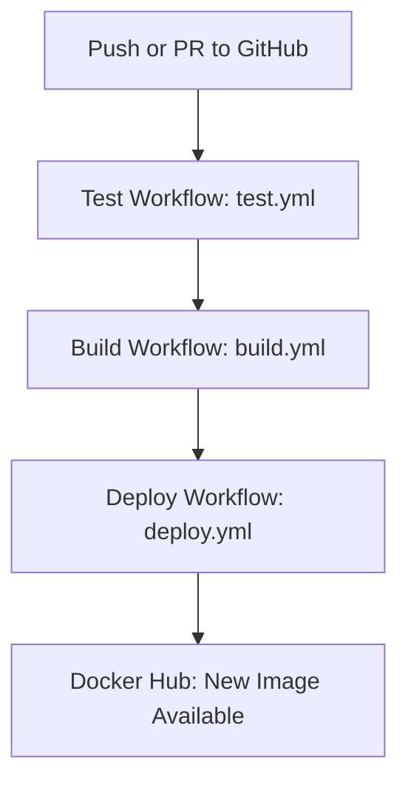

# Book-A-Doc CI/CD Pipeline

## Tables of Contents

1. [Overview](#overview)  
2. [CI/CD Workflow Files](#ci-cd-workflow-files)  
3. [Tools and Services Used](#tools-and-services-used)  
4. [Why GitHub Actions and Docker Hub](#why-github-actions-and-docker-hub)  
5. [CI/CD Flow Explanation](#ci-cd-flow-explanation)  
6. [Secrets and Configuration](#secrets-and-configuration)  
7. [Deployment Instructions](#deployment-instructions)  
8. [Comparison to Other CI/CD Tools](#comparison-to-other-cicd-tools)

## Overview

The Book-A-Doc application uses a Continuous Integration and Continuous Deployment (CI/CD) pipeline to automate the build, test, and deployment process. This ensures application quality, reduces manual errors, and streamlines development workflows.

## CI/CD Workflow Files

The following GitHub Actions workflows are defined:

| File Name     | Description                                 |
|---------------|---------------------------------------------|
| `test.yml`    | Runs frontend and backend test suites       |
| `build.yml`   | Builds Docker images for frontend/backend   |
| `deploy.yml`  | Pushes Docker images to Docker Hub          |

All workflows are located in:  
`.github/workflows/`

## Tools and Services Used

- **GitHub Actions:** Automates build, test, and deploy stages via YAML workflows.
- **Docker Hub:** Stores container images used for production deployment.
- **MongoDB (via service):** Runs in-memory for integration tests during CI.
- **Vitest, Jest, Supertest:** Used for frontend and backend tests.

## Why GitHub Actions and Docker Hub

- **GitHub Actions:**
  - Native GitHub integration
  - Zero additional setup required
  - Parallel jobs, caching, and matrix builds supported

- **Docker Hub:**
  - Easiest image registry for small teams
  - Compatible with Render, AWS, and other hosts

These tools were chosen for their simplicity, integration capabilities, and community support.

## CI/CD Flow Explanation



### Triggers
- `push`, `pull_request` → runs tests
- `push to main` → triggers build
- `build success` → triggers deployment

### Structure
- Test runs install and verify both frontend and backend
- Build compiles production-ready Docker images
- Deploy authenticates and pushes to Docker Hub

## Secrets and Configuration

Add the following secrets to your GitHub repo:

| Secret Name         | Purpose                        |
|---------------------|--------------------------------|
| `DOCKER_USERNAME`   | Your Docker Hub username       |
| `DOCKER_PASSWORD`   | Docker Hub password or token   |

> Secrets are injected at runtime and never exposed in logs.

## Deployment Instructions

1. Push code to `main`
2. GitHub Actions builds and pushes images:
   - `your-dockerhub-username/bookadoc-frontend`
   - `your-dockerhub-username/bookadoc-backend`
3. These images can now be pulled by your production server:
   ```bash
   docker pull your-dockerhub-username/bookadoc-frontend
   docker pull your-dockerhub-username/bookadoc-backend
   ```

## Comparison to Other CI/CD Tools

| Tool            | Pros                                      | Cons                                      |
|------------------|-------------------------------------------|--------------------------------------------|
| GitHub Actions   | Native to GitHub, free tier, flexible     | Less customizable than Jenkins             |
| Jenkins          | Highly configurable                      | Requires setup and maintenance             |
| GitLab CI/CD     | Integrated with GitLab, powerful          | Not native to GitHub repositories          |
| CircleCI         | Optimized for Docker workflows            | Limited on free tier                       |

For this project, **GitHub Actions** was the most streamlined and maintainable option due to its direct integration and lower operational overhead.

